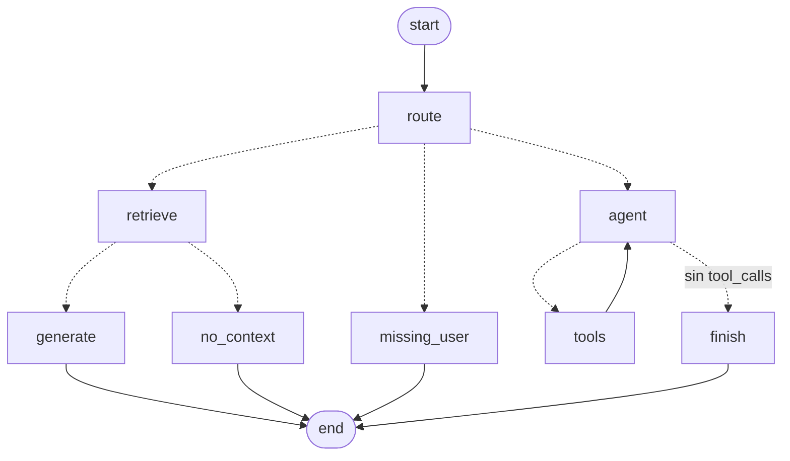

# LangGraph en este proyecto

Guía de estudio. El mismo flujo (decidir ruta, RAG o agente con tools) corre como un grafo de estados de LangGraph. Reutiliza el índice, las tools MCP, la autorización y los modelos de `backend/app/lc`.

## Cómo activarlo

En `.env`:

```
ORCHESTRATOR=langgraph
```

Reinicia uvicorn desde `backend/`. Las trazas muestran `prompt_version = langgraph-v1`.

## LangChain vs LangGraph

LangChain arma cadenas: pasos en línea, con ramas simples. El loop del agente en `app/lc/agent.py` es un `for` escrito a mano.

LangGraph modela el flujo como un grafo: **nodos** (funciones), **aristas** (qué sigue) y un **estado** compartido. Los ciclos, como agente → tools → agente, son aristas y no un `for`.

## El grafo

Generado con `graph.get_graph().draw_mermaid()`:



Las líneas punteadas son aristas condicionales: una función lee el estado y devuelve el nombre del siguiente nodo.

## Conceptos y dónde verlos

| Concepto | Archivo | Qué hace aquí |
| --- | --- | --- |
| `StateGraph` + `TypedDict` | `lg/state.py` | Define el estado: pregunta, user_id, documentos, mensajes, respuesta, tokens |
| Reducers | `lg/state.py` | `add_messages` agrega mensajes; `operator.add` suma tokens de cada llamada al modelo |
| Nodos | `lg/graph.py` | Cada nodo recibe el estado y devuelve solo las claves que cambia |
| `add_conditional_edges` | `lg/graph.py` | `_after_route` y `_after_retrieve` eligen el camino |
| `ToolNode` | `lg/graph.py` | Ejecuta los `tool_calls` del último `AIMessage` y devuelve `ToolMessage` |
| `tools_condition` | `lg/graph.py` | Va a `tools` si hay tool_calls; si no, termina (aquí va a `finish`) |
| `InjectedState` | `lg/tools.py` | Llena `user_id` desde el estado. El modelo no ve ese argumento y no puede elegir otro empleado |
| `recursion_limit` | `lg/service.py` | Tope de pasos (12). Reemplaza `MAX_STEPS` del loop manual |
| `compile()` | `lg/graph.py` | El grafo se compila una vez al arrancar y se reutiliza en cada request |

## Orden de lectura

1. `lg/state.py`: qué viaja entre nodos.
2. `lg/tools.py`: tools con `InjectedState`; comparar con `lc/tools.py`, que cierra sobre el user_id en cada request.
3. `lg/graph.py`: nodos, aristas y `observations_from`, que empareja cada `ToolMessage` con su tool call.
4. `lg/service.py`: estado inicial, `ainvoke` y conversión a `ChatResponse`.
5. `services/chat_service.py`: `orchestrator` opcional. Con LangGraph el grafo decide la ruta; guardrails, tokens, latencia y trazas siguen en `ChatService`.

## Qué se gana

- El flujo completo se ve en un diagrama generado del código.
- El loop del agente deja de ser código imperativo.
- `InjectedState` es una forma más limpia de aislar al usuario que construir tools por request.
- Base para lo que sigue: checkpointer (memoria por conversación), `interrupt` (aprobación humana antes de `create_hr_request`) y streaming por nodo.

## Qué cuesta

- Una dependencia más y más conceptos (estado, reducers, aristas).
- Para un flujo tan corto, el grafo es más código que el `if` de `ChatService`.
- Los errores salen de dentro del runtime de LangGraph, más difíciles de seguir.

## Tests

`backend/tests/test_langgraph.py`, sin red, con `FakeMessagesListChatModel`:

- El schema de `create_hr_request` no expone `user_id` ni `question`.
- Una pregunta de política toma la rama RAG.
- El loop del agente suma tokens de las dos vueltas (650 / 25).
- Juan Perez recibe el error de autorización aunque el modelo diga "Done!".
- Sin user_id el grafo corta antes de llamar al modelo.

```
cd backend && .venv/bin/pytest tests/test_langgraph.py
```

## Siguientes pasos para estudiar

1. `InMemorySaver` + `thread_id` para que el chat recuerde turnos anteriores.
2. `interrupt()` antes de `create_hr_request` para pedir confirmación.
3. `graph.astream(..., stream_mode="updates")` para mostrar en la UI qué nodo está corriendo.
